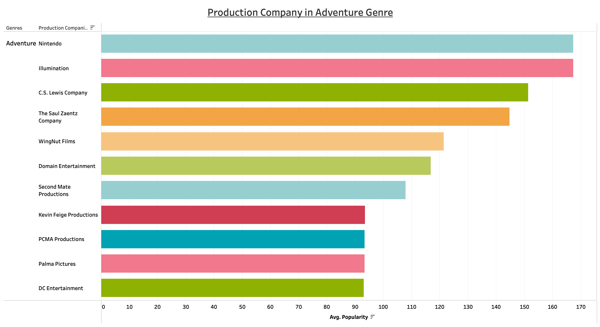

# MOVIE ANALYSIS

## Overview

The dataset included films made from the beginning of 2000 to the end of 2023 where we used various data to find the most popular genre to invest time and money in.

Key Findings:

    Through the analsys, we discovered the most popular genres are: Action, Adventure, Animation, Family and Romance

## Business Problem

In order to make a profitable movie, we could look at popular genres to make movies in:

    1. Which are the top five popular genres
    2. Who are the best directors associated with each genre
    3. Which companies are best to partner with which are associated with a genre and make a profit

## Analysis

First we identified the best directors to work with based on hig voter rating with a high number of votes

Then we identified the best production companies to partner with per genre

, 

Popular Company per Genre

## Conclusion

From the findings, we would recommend:

Directors:
    
    Andrew Adamson, Catherine Hardwicke, James Cameron

Production Companies:
    
    Nintendo, Lightningstorm Entertainment, Imprint Entertainment

Genres:

    Action, Adventure, Animation, Family, Romance